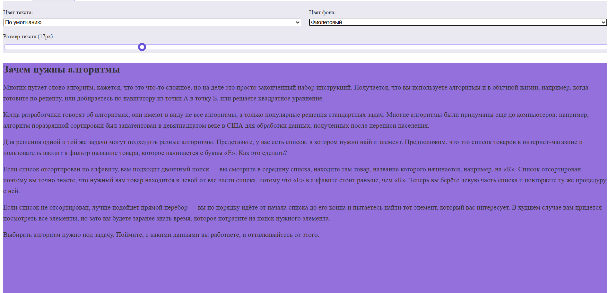

# read-mode
# 🌐 Личный сайт / Frontend-проект

Простой одностраничный сайт, позволяющий изменять цвет текста, фон текста, размер. С визуальной точки зрения сайт не закончен.

## 📁 Структура проекта
- `index.html` — Главная страница
- `/css/` — Стилизация
- `/js/` — Cкрипты
- `/img/` — Изображения

## 🛠 Использовано:
- HTML5
- CSS3
- JavaScript (ES6)

## 📸 Превью

## 🚀 Запуск
Открой файл `index.html` в браузере — сайт готов!

## 📌 Автор
[Мария Авдеева](https://github.com/marywwer)
